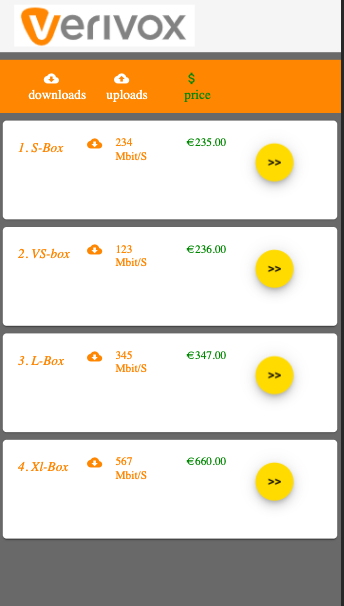
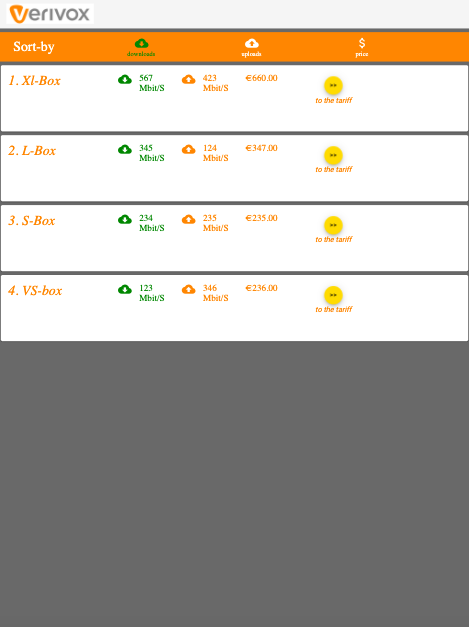
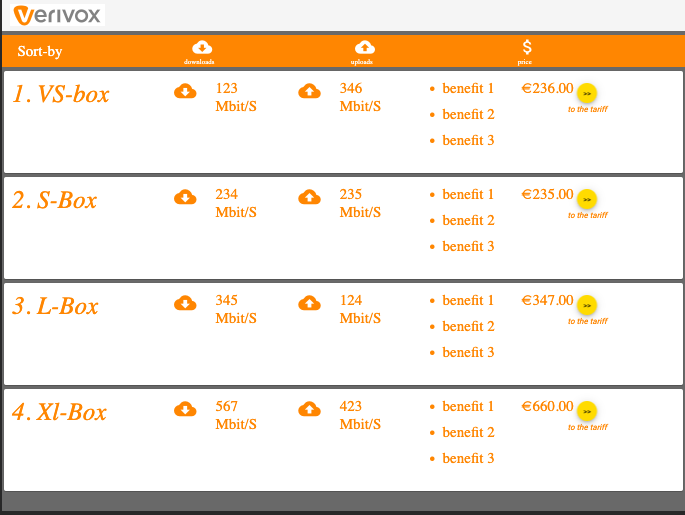
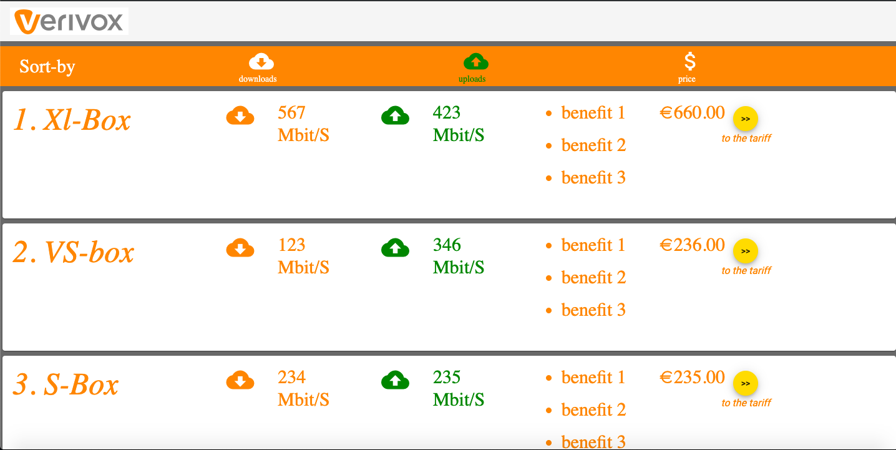

# Project is created from scratch using ng new app

* run "npm install" to install dependencies 
* Angular material used for design beside bootstrap.
* Angular-8.3.19, Typescript-3.5.3 and SASS.
* Simple Unit-test cases are written to validate inputs and attributes rendering. 
* I didn't complete what i was looking for because of the time. 
* Time Taken: 3 hours (including environment setup and libraries selection).
* if i have the time (
    use features of SASS,
    provide better structure, 
    handle more cases from design perspective, 
    write stronger unit test, 
    error-handling ...etc)

# VerivoxTask
This project was generated with [Angular CLI](https://github.com/angular/angular-cli) version 8.3.19.

## Development server

Run `ng serve` for a dev server. Navigate to `http://localhost:4200/`. The app will automatically reload if you change any of the source files.

## Build

Run `ng build` to build the project. The build artifacts will be stored in the `dist/` directory. Use the `--prod` flag for a production build.

## Running unit tests

Run `ng test` to execute the unit tests via [Karma](https://karma-runner.github.io).
